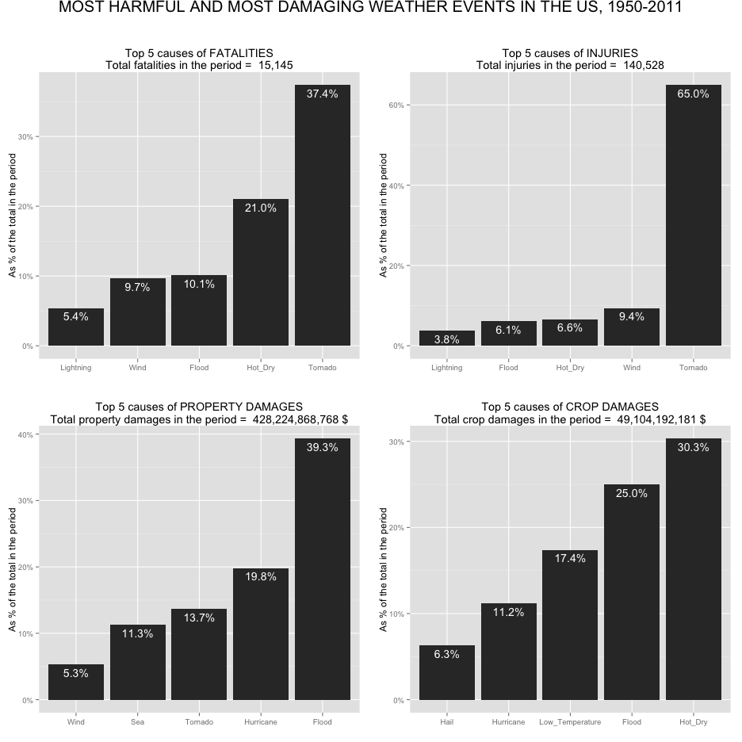
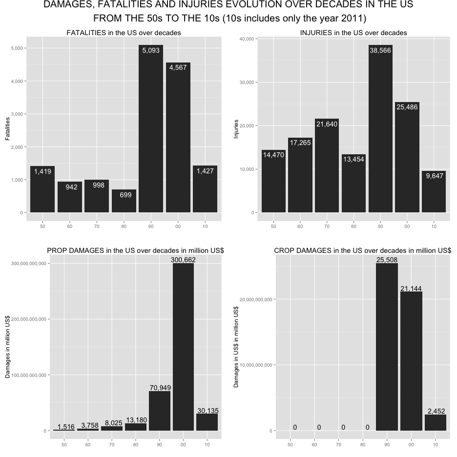
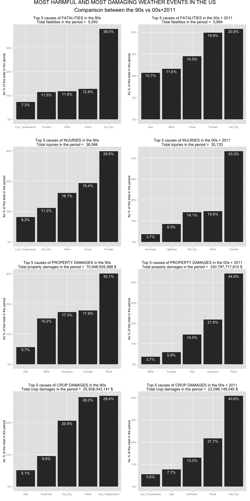

# MOST HARMFUL AND DESTRUCTIVE ATMOSPHERIC EVENTS IN THE US IN THE 1950-2011 PERIOD  
===========================================================================================


## SYNOPSYS  
===========================================================================================
This study aims to analyze the consequences of weather events as recorded by U.S. National Oceanic and Atmospheric Administration's (NOAA) from 1950 to 2011. The study will point out the weather events causing the highest damage to human properties and agriculture crops and the events causing the highest number of injuries and fatalities.  
Injuries, fatalities, property and crop damages will be analyzed separately because it is author's belief that, for instance, injuries and fatalities cannot be summed for their different nature and meaning; additionally damages to properties may be of higher interest than damages to crops, or viceversa, depending on the use made of this document and its audience.  
First aggregated data will be shown. Afterwards, results will be split by decades pointing out differences, which are probably due to different methods of gathering data over time. In the end, a comparison between events from 90s and events from 00s will be reported. It will be shown that while tornados have been the most harmful and floods have been the most destructive weather events taking the time period as a whole, if we only consider the last 2 decades, hot weather have become more relevant than tornados as major cause of fatalities while floods keeps on being the worst enemy for properties.  
A code-visible data processing section is included for reader to be able to reproduce the study and validate it.
  
    
    
  

## DATA PROCESSING  
===========================================================================================
In this following section, it will be described the manipulation used to clean, reshape, classify and plot the data.


### READING DATA, COERSION AND SUMMARY 
===========================================================================================

```r

## Please install and load the R.utils in order to 'bunzip' the .bz2 file
## Make also sure to have either the StormData.csv.bz2 or StormData.csv
## stored in your working directory

## Unzip and load the source file

if ((!file.exists("StormData.csv")) & (!file.exists("StormData.csv.bz2"))) {
    message("please make sure to download either the file StormData.csv.bz2, or StormData.csv in your working directory")
    return()
}
if ((!file.exists("StormData.csv")) & (file.exists("StormData.csv.bz2"))) {
    bunzip2("StormData.csv.bz2", "StormData.csv")
}
raw_data <- read.csv("StormData.csv")

## Subsets over the columns of interest, eliminating the rest in order to
## make the huge dataframe easier to handle
data <- raw_data[, c("STATE", "BGN_DATE", "EVTYPE", "FATALITIES", "INJURIES", 
    "PROPDMG", "PROPDMGEXP", "CROPDMG", "CROPDMGEXP")]

## Un-factiring the char variables
data$PROPDMGEXP <- as.character(data$PROPDMGEXP)
data$CROPDMGEXP <- as.character(data$CROPDMGEXP)
data$EVTYPE <- as.character(data$EVTYPE)

## Let's take a first look to the data frame
str(data)
```

```
## 'data.frame':	902297 obs. of  9 variables:
##  $ STATE     : Factor w/ 72 levels "AK","AL","AM",..: 2 2 2 2 2 2 2 2 2 2 ...
##  $ BGN_DATE  : Factor w/ 16335 levels "1/1/1966 0:00:00",..: 6523 6523 4242 11116 2224 2224 2260 383 3980 3980 ...
##  $ EVTYPE    : chr  "TORNADO" "TORNADO" "TORNADO" "TORNADO" ...
##  $ FATALITIES: num  0 0 0 0 0 0 0 0 1 0 ...
##  $ INJURIES  : num  15 0 2 2 2 6 1 0 14 0 ...
##  $ PROPDMG   : num  25 2.5 25 2.5 2.5 2.5 2.5 2.5 25 25 ...
##  $ PROPDMGEXP: chr  "K" "K" "K" "K" ...
##  $ CROPDMG   : num  0 0 0 0 0 0 0 0 0 0 ...
##  $ CROPDMGEXP: chr  "" "" "" "" ...
```

  
    
### DAMAGES CALCULATION 
===========================================================================================
    
  
The general idea of what we are going to implement in the next is to quantify the damages, injuries and fatalities and sum these quantities grouping by event type. To do so, first of all we need to translate damages from string to numerical values expressed in a uniform scale.
In other words, we first need to translate string multipliers (data$PROPDMGEXP and data$CROPDMGEXP columns for properties and crop damages respectively) into numeric multipliers and then multiply these multipliers with the corresponding damage values, i.e. data$PROPDMG and CROPDMG columns for properties and crop damages respectively.
Once calculated the Prop and Crop damages of each atmospheric event, we will then sum up these values grouping by event type (column data$EVTYPE).  

This is what we are going to do in the next lines. Let's start with a quick look and to the data and let's clean it.
  
    
    
   

```
## 
##             +      -      0      1      2      3      4      5      6 
## 465934      5      1    216     25     13      4      4     28      4 
##      7      8      ?      B      H      K      M      h      m 
##      5      1      8     40      6 424665  11330      1      7
```

```
## 
##             0      2      ?      B      K      M      k      m 
## 618413     19      1      7      9 281832   1994     21      1
```

  
    
    
  
As you can see, from the tables above, the exponential multipliers CROPDMGEXP and PROPDMGEXP are characters that we first need to clean from errors and then translate into numerical factors. 
Values as 1, 2, 3 have to be translated into exponential multiplying factors 10^1, 10^2, 10^3  
Chars like B(or b), M (or m), K (or k), H (or h) have to be translated into 10^9, 10^6, 10^3, 10^2 respectively. 
Conversely, blank values or characters like "+", "-", ? etc are typing errors and will be translated into a multiplier equal to 1.

Let's start by replacing errors.
  
    
    
  

```r
## Let's first build the conversion table
fact_as_char <- c("B", "b", "M", "m", "K", "k", "h", "H", "9", "8", "7", "6", 
    "5", "4", "3", "2", "1", "0")
fact_as_num <- c(10^9, 10^9, 10^6, 10^6, 10^3, 10^3, 10^2, 10^2, 10^9, 10^8, 
    10^7, 10^6, 10^5, 10^4, 10^3, 10^2, 10^1, 1)
factors <- data.frame(fact_as_char, fact_as_num)

## Those EXP string in our dataframe which are not included in the above
## conversion dataframe, are considered errors and will be replaced with
## string '0' which in turn (see the table above) corresponds to the numeric
## value of 1.
data[!(data$PROPDMGEXP %in% fact_as_char), ]$PROPDMGEXP <- "0"
data[!(data$CROPDMGEXP %in% fact_as_char), ]$CROPDMGEXP <- "0"
```

  
    
    
  
Let's now have a look to the corrected results of multipliers. As you can see below, all wrong characters have now been replaced with character "0" and these 2 columns (PROPDMGEXP and CROPDMGEXP) have been cleaned meaning that they now only take permitted values, i.e. values included in the above-defined converting table.
  
    
    
  


```r
table(data$PROPDMGEXP)
```

```
## 
##      0      1      2      3      4      5      6      7      8      B 
## 466164     25     13      4      4     28      4      5      1     40 
##      H      K      M      h      m 
##      6 424665  11330      1      7
```

```r
table(data$CROPDMGEXP)
```

```
## 
##      0      2      B      K      M      k      m 
## 618439      1      9 281832   1994     21      1
```

  
    
    
  
After having cleaned them in their string fomat, let's now convert the columns PROPDMGEXP and CROPDMGEXP into numerical multipliers according to the converting table defined above and let's calculate the properties and crop damages by multiplying the value of the damage (PROPDMG and CROPDMG) of each event with the corresponding numeric multiplier that we have just calculated for PROPDMGEXP and CROPDMGEXP columns.
With this operation we have now calculated the total damage both to crop and to properties of each atmospheric event in the US from 1950 to 2011.
  
    
    
  


```r
## Translate the string factors into numerical factors according to the
## conversion table.  Caluclate total damages and save the results into 2
## news columns: data$PROPdamage and data$CROPdamage Notice that errors were
## replaced with character '0' which in turn are now converted in a numerical
## factor equal to 1.
data$PROPdamage <- data$PROPDMG * factors[match(data$PROPDMGEXP, factors$fact_as_char), 
    ]$fact_as_num
data$CROPdamage <- data$CROPDMG * factors[match(data$CROPDMGEXP, factors$fact_as_char), 
    ]$fact_as_num
```

  
    
    
  
### CLASSIFICATION OF ATMOSPHERIC EVENTS. PHASE 1: AUTOMATED PROCEDURE 
===========================================================================================

Let's now have a look to EVTYPE (event types) since what we want to do is summing all quantities of interest grouping by event type.
  
    
    
  

```r
## Let's calculate the number of distinct EVTYPE Let's use only upper case to
## make this counting not case sensitive
data$EVTYPE <- toupper(data$EVTYPE)
events <- unique(data$EVTYPE)
unique_not_corrected_event_names <- unique(data$EVTYPE)
number_of_unique_not_corrected_event_names <- length(unique_not_corrected_event_names)
```

  
    
    
    
In the intial data set 902297 atmospheric events are classified into 898 unique categories which is such a large number that would lead to results not easy to handle and to interpret. We need to define fewer but larger categories to group events and to improve the readability and interpretation of the results.  

Additionally, a quick look to these names reveals that a categorization is needed also to clean initial categories from numerous errors and non-uniformities. For instance, in the initial dataset WIND, WND, WINT are 3 different, separated EVTYPEs. A non-uniform classification and typing errors make these 3 categories appear as they were different each other while they actually all represent "Wind" atmospheric events. 

To solve the above-mentioned problems, a 2 steps categorization of EVTYPES will be now performed. The first automatic step will programmatically categorize EVTYPE depending on if it contains specific words. A second optional categorization will be later performed as a refinement of this first step. In other words, on optional basis, the second step will allow categorizing all those events, which were not categorized through the first step. You can skip this second step but if you do so, you will reach results similar to those of this study but not exactly the same since by skipping the refinement step, the resulting categorization would be more generic.

Let's start with the first categorization step:  
1. EVTYPES containing one of these words (WIND, WND, WINT) will be now classified as a Wind event type  
2. EVTYPES containing the word HAIL as Hail  
3. EVTYPES containing FLOOD as Flood  
4. EVTYPES containing TORNADO as Tornado  
5. EVTYPES containing LIGHTNING as Lightning    
6. EVTYPES containing (SNOW or ICE or COLD or BLIZZARD or ICY or FREEZ or FROST or ICE) as Low_Temperature  
7. EVTYPES containing (DRY or DROUGHT or WARMTH or HEAT or DRYNESS) as Hot_Dry  
8. EVTYPES containing (RAIN or PRECIPITATION or WET) as Rain  
  
    
    
  


```r

Word <- c("WIND", "WND", "WINT", "HAIL", "FLOOD", "TORNADO", "LIGHTNING", "SNOW", 
    "ICE", "COLD", "BLIZZARD", "ICY", "FREEZ", "FROST", "DRY", "DROUGHT", "WARMTH", 
    "HEAT", "DRYNESS", "RAIN", "PRECIPITATION")
Category <- c("Wind", "Wind", "Wind", "Hail", "Flood", "Tornado", "Lightning", 
    "Low_temperature", "Low_Temperature", "Low_Temperature", "Low_Temperature", 
    "Low_Temperature", "Low_Temperature", "Low_Temperature", "Hot_Dry", "Hot_Dry", 
    "Hot_Dry", "Hot_Dry", "Hot_Dry", "Rain", "Rain")

## Creates a conversion table for the first step categorization
first_classification <- data.frame(Word, Category)
first_classification$Word <- as.character(first_classification$Word)
first_classification$Category <- as.character(first_classification$Category)
```

  
    
    
    
Let's display the classification table and let's use it to implement this first classification step.
  
    
    
  

```r

first_classification
```

```
##             Word        Category
## 1           WIND            Wind
## 2            WND            Wind
## 3           WINT            Wind
## 4           HAIL            Hail
## 5          FLOOD           Flood
## 6        TORNADO         Tornado
## 7      LIGHTNING       Lightning
## 8           SNOW Low_temperature
## 9            ICE Low_Temperature
## 10          COLD Low_Temperature
## 11      BLIZZARD Low_Temperature
## 12           ICY Low_Temperature
## 13         FREEZ Low_Temperature
## 14         FROST Low_Temperature
## 15           DRY         Hot_Dry
## 16       DROUGHT         Hot_Dry
## 17        WARMTH         Hot_Dry
## 18          HEAT         Hot_Dry
## 19       DRYNESS         Hot_Dry
## 20          RAIN            Rain
## 21 PRECIPITATION            Rain
```

```r

## Let's create and initialize a new column in the daata frame, called
## EV_CATEGORY where we'll store the new classification.
data$EV_CATEGORY <- "***"

## Perform the first classification step: if EVTYPE contains a word of the
## first step conversion table, the corresponding category in the conversion
## table will be stored in the column EV_CATEGORY
for (i in 1:nrow(first_classification)) {
    data[grepl(first_classification[i, ]$Word, data$EVTYPE, fixed = TRUE), ]$EV_CATEGORY <- first_classification[i, 
        ]$Category
}

aggr <- aggregate(data[c("FATALITIES", "INJURIES", "PROPdamage", "CROPdamage")], 
    by = data[c("EV_CATEGORY")], FUN = sum)
```


```r
## Notice that those rows which still contains the initializing character ***
## in the EV_CATEGORY are the events which have not been classified yet.
## Let's calculate a few values about these events.
classified_fatalities <- sum(aggr[aggr$EV_CATEGORY != "***", ]$FATALITIES)
classified_injuries <- sum(aggr[aggr$EV_CATEGORY != "***", ]$INJURIES)
classified_CROPdamage <- sum(aggr[aggr$EV_CATEGORY != "***", ]$CROPdamage)
classified_PROPdamage <- sum(aggr[aggr$EV_CATEGORY != "***", ]$PROPdamage)
tot_fatalities <- sum(aggr$FATALITIES)
tot_injuries <- sum(aggr$INJURIES)
tot_CROPdamage <- sum(aggr$CROPdamage)
tot_PROPdamage <- sum(aggr$PROPdamage)

classified_number <- length(unique(data[data$EV_CATEGORY != "***", ]$EVTYPE))
uniq <- unique(data[data$EV_CATEGORY == "***", ]$EVTYPE)
unclassified_names_left <- length(uniq)
write.csv(uniq, "Unique unclassified events.csv")
```

  
  
   
   
  
  
### CLASSIFICATION OF ATMOSPHERIC EVENTS. PHASE 2: MANUAL OPTIONAL PROCEDURE 
===========================================================================================
    
    
According to this first step classification, the initial 898 unique categories have been reduced since 621 of them were grouped into 21 more compelling categories. This categorization allowed to classify:  
1)95.4 % of total injuries  
2)89.7 % of total fatalities  
3)86.1 % of total crop damages  
4)64.7 % of total property damages  into these new categories defined above. 

To improve the amount of classified injuries, fatalities, properties and crop damages, a second, manual classification can be performed on optional basis on the remaining 277 events which have not been classified in the first step classification.  

In the last line of the last code chunk, these unclassifies 277 events have been saved in a file ("Unique unclassified events.csv") for a subsequent optional manual classification to refine the final results.  
The manual events classification applied to this study are listed in the Appendix 1. 
At this point you have 2 options:  
1) If you want to reproduce exactly this study, you need to take the table in Appendix 1 and save those values in a csv file in your working directory. This file has to be saved as "Unique events after manual classification.csv", should not contain any header and should use ";" as values separator. By doing so, you will reach ecactly the same results as this study.  
2) Alternatively, you can skip this manual operation. The event types which were not classified in the first step will be all included in a generic category called Other. Results would be analogous to those of this study but less accurate.

In the next few lines, this second conversion table will be open and read in R and will be used to classify the 277 events which have not been classified in the first step classification.  


```r
## Let's now load the manually edited classification table which will allows
## us to classify the remaining events.
if (file.exists("Unique events after manual classification.csv")) {
    ## If the file exists, load the conversion table and apply the second step
    ## manual classification
    Storm_classification <- read.table("Unique events after manual classification.csv", 
        sep = ";")
    names(Storm_classification) <- c("Word", "Category")
    
    Storm_classification$Category <- as.character(Storm_classification$Category)
    Storm_classification$Word <- as.character(Storm_classification$Word)
    
    for (i in 1:nrow(Storm_classification)) {
        d <- data$EV_CATEGORY == "***" & data$EVTYPE == Storm_classification[i, 
            ]$Word
        data[d, ]$EV_CATEGORY <- Storm_classification[i, ]$Category
    }
} else {
    ## If file does not exist, the second step manual classification will be
    ## skipped and the remaining events will be grouped in the Other category.
    message("hol")
    d <- data$EV_CATEGORY == "***"
    data[d, ]$EV_CATEGORY <- "Other"
}

df <- aggregate(data[c("FATALITIES", "INJURIES", "PROPdamage", "CROPdamage")], 
    by = data[c("EV_CATEGORY")], FUN = sum)
classified_number <- length(unique(data[data$EV_CATEGORY != "***", ]$EVTYPE))
```

  
    
    
  
The classification process of EVTYPE is now ended. 
All the initial 902297  events have been categorized into the following 18 categories.

  
    
    
  

```r
df$EV_CATEGORY
```

```
##  [1] "Avalanche"       "Duststorm"       "Fire"           
##  [4] "Flood"           "Hail"            "Hot_Dry"        
##  [7] "Hurricane"       "Landslide"       "Lightning"      
## [10] "Low_Temperature" "Low_temperature" "Other"          
## [13] "Rain"            "Sea"             "Tornado"        
## [16] "Typhoon"         "Waterspout"      "Wind"
```

  
    
    
   
   
### EVALUATING THE WEIGHT OF CATEGORY "OTHER" 
===========================================================================================

As you can see, among the new categories, there is one called "Other" which contains all those events which could not be classified in other way.

Before proceeding with our analysis, let's evaluate the "weight" of the category "Other", compared with the rest of categories to make sure that it is small enough not to miss significant results for a too generic classification: 
  
    
    
  

```r
## Calculate the weight of 'Other' with respect of other categories in terms
## of fatalities, injuries and damages.
Other_fatalities <- sum(df[df$EV_CATEGORY == "Other", ]$FATALITIES)
Other_injuries <- sum(df[df$EV_CATEGORY == "Other", ]$INJURIES)
Other_CROPdamage <- sum(df[df$EV_CATEGORY == "Other", ]$CROPdamage)
Other_PROPdamage <- sum(df[df$EV_CATEGORY == "Other", ]$PROPdamage)
tot_fatalities <- sum(df$FATALITIES)
tot_injuries <- sum(df$INJURIES)
tot_CROPdamage <- sum(df$CROPdamage)
tot_PROPdamage <- sum(df$PROPdamage)

Non_other <- length(data[data$EV_CATEGORY != "Other", ]$EVTYPE)
Other <- length(data[data$EV_CATEGORY == "Other", ]$EVTYPE)
```

  
    
    
  
Of the initial 902297 events, as low as 5640 events have been classified in the group Other while 896657 have been classified in more specific categories. 

Additionally, the category "Other" represents:  
1) 0.98 % of total injuries  
2) 0.78 % of total fatalities   
3) 0.02 % of total crop damages   
4) 0.02 % of total proprerty damages  
  
This numbers make me conclude that the category "Other"" is small enough and we do not need further classification refinements.

The number provided above are true under the assumption that you the manual classification of event type have not been skipped.
If you decided to skip the manual classification step of event types, all the events which have not been classified through the automated first classification step were included in the "Other" category. If you decided to skip the manual classification the numbers presented above would be therefore sensibily higher.  
More specifically, in case of skipping the manual optional classification, the category "Other"" would represent:  
1) 4.62 % of total injuries  
2) 10.29 % of total fatalities  
3) 13.85 % of total crop damages  
4) 35.34 % of total proprerty damages  
From now on, results will be shown only in the hypotesis that the second manual classification has been performed.

Let's now sum the variables of interest, grouping them by the new categories we have introduced. Finally let's plot the results. We will point out the 5 event types causing the highest number of fatalities, the top 5 categories causing the highest damages to crop and so on.  
    
    
  
  
### BUILDING PLOT 1 (DISPLAYED IN THE RESULTS SECTION): AGGREGATED DATA FROM 1950 to 2011 
===========================================================================================
In this and following section, 3 combined plots will be creatd. Plase refer to the result section, to visualize them and read the comments on them.


```r

## Let's first load a few library
library("ggplot2")
library("scales")
library("gridExtra")
```

```
## Loading required package: grid
```

```r

## Aggregate the variables of interest according to the calssification we
## made above.
df <- aggregate(data[c("FATALITIES", "INJURIES", "PROPdamage", "CROPdamage")], 
    by = data[c("EV_CATEGORY")], FUN = sum)

df$EV_CATEGORY <- as.character(df$EV_CATEGORY)


## Calculate the weight of each event with respect of all other events. An
## example to better explain: the tornado which hit the states in 1961, what
## percentage of injuries, fatalities etc have coused with respect of total
## injuries, fatalities etc since 1950?
df$Fat_percentage <- round(df$FATALITIES/sum(df$FATALITIES), 3)
df$Inj_percentage <- round(df$INJURIES/sum(df$INJURIES), 3)
df$CROP_percentage <- round(df$CROPdamage/sum(df$CROPdamage), 3)
df$PROP_percentage <- round(df$PROPdamage/sum(df$PROPdamage), 3)


## Inizializing the 4 new columns which will contain the percentage of each
## event with respect to the rest.
df$Fat_Cat <- "Others"
df$Inj_Cat <- "Others"
df$CROP_Cat <- "Others"
df$PROP_Cat <- "Others"

## Mark the top 5 event type per variable of interest
df <- df[order(-df$Fat_percentage), ]
df[1:5, ]$Fat_Cat <- df[1:5, ]$EV_CATEGORY

df <- df[order(-df$Inj_percentage), ]
df[1:5, ]$Inj_Cat <- df[1:5, ]$EV_CATEGORY

df <- df[order(-df$CROP_percentage), ]
df[1:5, ]$CROP_Cat <- df[1:5, ]$EV_CATEGORY

df <- df[order(-df$PROP_percentage), ]
df[1:5, ]$PROP_Cat <- df[1:5, ]$EV_CATEGORY


## Let's create the plots to display.

## Let's first disable de scientific notation for numbers
options(scipen = 999)

## Plot 1: fatalities
df1 <- aggregate(df[, c("Fat_percentage", "FATALITIES")], by = df[c("Fat_Cat")], 
    FUN = sum)
df1 <- df1[order(-df1$Fat_percentage), ]
n <- format(sum(df1$FATALITIES), big.mark = ",")

titl <- paste("Top 5 causes of FATALITIES\nTotal fatalities in the period = ", 
    n, sep = " ")
p1 <- ggplot(data = df1[df1$Fat_Cat != "Others", ], aes(x = reorder(Fat_Cat, 
    Fat_percentage), y = Fat_percentage)) + geom_bar(stat = "identity") + scale_size_area() + 
    xlab("") + ylab("As % of the total in the period") + ggtitle(titl) + scale_y_continuous(labels = percent) + 
    geom_text(aes(label = percent(Fat_percentage)), vjust = 1.5, colour = "white")

## Plot 2: injuries
df2 <- aggregate(df[, c("Inj_percentage", "INJURIES")], by = df[c("Inj_Cat")], 
    FUN = sum)
df2 <- df2[order(-df2$Inj_percentage), ]


n <- format(sum(df2$INJURIES), big.mark = ",")

titl <- paste("Top 5 causes of INJURIES\nTotal injuries in the period = ", n, 
    sep = " ")
p2 <- ggplot(data = df2[df2$Inj_Cat != "Others", ], aes(x = reorder(Inj_Cat, 
    Inj_percentage), y = Inj_percentage)) + geom_bar(stat = "identity") + scale_size_area() + 
    xlab("") + ylab("As % of the total in the period") + ggtitle(titl) + scale_y_continuous(labels = percent) + 
    geom_text(aes(label = percent(Inj_percentage)), vjust = 1.5, colour = "white")

## Plot 3: Property damages
df3 <- aggregate(df[, c("PROP_percentage", "PROPdamage")], by = df[c("PROP_Cat")], 
    FUN = sum)
df3 <- df3[order(-df3$PROP_percentage), ]

n <- format(round(sum(df3$PROPdamage), 0), big.mark = ",")

titl <- paste("Top 5 causes of PROPERTY DAMAGES\nTotal property damages in the period = ", 
    n, "$", sep = " ")
p3 <- ggplot(data = df3[df3$PROP_Cat != "Others", ], aes(x = reorder(PROP_Cat, 
    PROP_percentage), y = PROP_percentage)) + geom_bar(stat = "identity") + 
    scale_size_area() + xlab("") + ylab("As % of the total in the period") + 
    ggtitle(titl) + scale_y_continuous(labels = percent) + geom_text(aes(label = percent(PROP_percentage)), 
    vjust = 1.5, colour = "white")


## Plot 4: Crop damages
df4 <- aggregate(df$CROP_percentage, df$CROPdamage, by = df[c("CROP_Cat")], 
    FUN = sum)


df4 <- aggregate(df[, c("CROP_percentage", "CROPdamage")], by = df[c("CROP_Cat")], 
    FUN = sum)
df4 <- df4[order(-df4$CROP_percentage), ]

n <- format(round(sum(df4$CROPdamage), 0), big.mark = ",")


titl <- paste("Top 5 causes of CROP DAMAGES\nTotal crop damages in the period = ", 
    n, "$", sep = " ")
p4 <- ggplot(data = df4[df4$CROP_Cat != "Others", ], aes(x = reorder(CROP_Cat, 
    CROP_percentage), y = CROP_percentage)) + geom_bar(stat = "identity") + 
    scale_size_area() + xlab("") + ylab("As % of the total in the period") + 
    ggtitle(titl) + scale_y_continuous(labels = percent) + geom_text(aes(label = percent(CROP_percentage)), 
    vjust = 1.5, colour = "white")


## Create a title
mn = textGrob("MOST HARMFUL AND MOST DAMAGING WEATHER EVENTS IN THE US, 1950-2011\n", 
    gp = gpar(fontsize = 20))

## The plot has been built but it will be displayed in the results section
```

  
    
    
  

### BUILDING PLOT 2 (DISPLAYED IN THE RESULTS SECTION): DATA PER DECADES
===========================================================================================    
  

```r
## Let's now create the same graphs but split by decades.

## Defactorize the variable BGN_DATE and coerce it into a data format
data$BGN_DATE <- as.Date(data$BGN_DATE, format = "%m/%d/%Y")

## Calculate the 'decade' from the year stored into BGN_DATE
data$Decade <- as.character(trunc((as.numeric(format(data$BGN_DATE, "%Y")) - 
    1900)/10) * 10)
## A few adjustments
data[data$Decade == "100", ]$Decade <- "00"
data[data$Decade == "110", ]$Decade <- "10"

## Create a ordered factor with decades
data$Decade = factor(data$Decade, levels = c("50", "60", "70", "80", "90", "00", 
    "10"))

## Aggregating data of interest by decades
df <- aggregate(data[c("FATALITIES", "INJURIES", "PROPdamage", "CROPdamage")], 
    by = data[c("EV_CATEGORY", "Decade")], FUN = sum)
df2 <- aggregate(data[c("FATALITIES", "INJURIES", "PROPdamage", "CROPdamage")], 
    by = data[c("Decade")], FUN = sum)

## Create the plots

## Plot 1: fatalities
titl <- "FATALITIES in the US over decades"
p1b <- ggplot(data = df2, aes(x = Decade, y = FATALITIES)) + geom_bar(stat = "identity") + 
    scale_size_area() + xlab("") + ylab("Fatalities") + ggtitle(titl) + scale_y_continuous(labels = comma) + 
    geom_text(aes(label = format(round((FATALITIES), 0), big.mark = ",")), vjust = 1.5, 
        colour = "white")


## Plot 2: injuries
titl <- "INJURIES in the US over decades"
p2b <- ggplot(data = df2, aes(x = Decade, y = INJURIES)) + geom_bar(stat = "identity") + 
    scale_size_area() + xlab("") + ylab("Injuries") + ggtitle(titl) + scale_y_continuous(labels = comma) + 
    geom_text(aes(label = format(round((INJURIES), 0), big.mark = ",")), vjust = 1.5, 
        colour = "white")


# Plot 3: Property damages
titl <- "PROP DAMAGES in the US over decades in million US$"
p3b <- ggplot(data = df2, aes(x = Decade, y = PROPdamage)) + geom_bar(stat = "identity") + 
    scale_size_area() + xlab("") + ylab("Damages in million US$") + ggtitle(titl) + 
    scale_y_continuous(labels = comma) + geom_text(aes(label = format(round((PROPdamage/1000000), 
    0), big.mark = ",")), vjust = -0.2)

## Plot 4: Crop damages
titl <- "CROP DAMAGES in the US over decades in million US$"
p4b <- ggplot(data = df2, aes(x = Decade, y = CROPdamage)) + geom_bar(stat = "identity") + 
    scale_size_area() + xlab("") + ylab("Damages in US$ in million US$") + ggtitle(titl) + 
    scale_y_continuous(labels = comma) + geom_text(aes(label = format(round((CROPdamage/1000000), 
    0), big.mark = ",")), vjust = -0.2)


## Title of the plot
mnb = textGrob("DAMAGES, FATALITIES AND INJURIES EVOLUTION OVER DECADES IN THE US\n FROM THE 50s TO THE 10s (10s includes only the year 2011)", 
    gp = gpar(fontsize = 20))

```


  
    
### BUILDING PLOT 3 PART 1 (DISPLAYED IN THE RESULTS SECTION): THE 90s
===========================================================================================    
    
  

```r
## In this section, graphs referring to years 90s are generated.  After the
## initial subsetting operation, the code is exactly the same as for the
## aggregated case already explained and commented above.


Nineties <- df[df$Decade == "90", ]

Nineties$EV_CATEGORY <- as.character(Nineties$EV_CATEGORY)

Nineties$Fat_percentage <- round(Nineties$FATALITIES/sum(Nineties$FATALITIES), 
    3)
Nineties$Inj_percentage <- round(Nineties$INJURIES/sum(Nineties$INJURIES), 3)
Nineties$CROP_percentage <- round(Nineties$CROPdamage/sum(Nineties$CROPdamage), 
    3)
Nineties$PROP_percentage <- round(Nineties$PROPdamage/sum(Nineties$PROPdamage), 
    3)


Nineties$Fat_Cat <- "Others"
Nineties$Inj_Cat <- "Others"
Nineties$CROP_Cat <- "Others"
Nineties$PROP_Cat <- "Others"


Nineties <- Nineties[order(-Nineties$Fat_percentage), ]
Nineties[1:5, ]$Fat_Cat <- Nineties[1:5, ]$EV_CATEGORY

Nineties <- Nineties[order(-Nineties$Inj_percentage), ]
Nineties[1:5, ]$Inj_Cat <- Nineties[1:5, ]$EV_CATEGORY

Nineties <- Nineties[order(-Nineties$CROP_percentage), ]
Nineties[1:5, ]$CROP_Cat <- Nineties[1:5, ]$EV_CATEGORY

Nineties <- Nineties[order(-Nineties$PROP_percentage), ]
Nineties[1:5, ]$PROP_Cat <- Nineties[1:5, ]$EV_CATEGORY


Nineties1 <- aggregate(Nineties[, c("Fat_percentage", "FATALITIES")], by = Nineties[c("Fat_Cat")], 
    FUN = sum)

Nineties1 <- Nineties1[order(-Nineties1$Fat_percentage), ]
n <- format(sum(Nineties1$FATALITIES), big.mark = ",")

titl <- paste("Top 5 causes of FATALITIES in the 90s\nTotal fatalities in the period = ", 
    n, sep = " ")
p_nineties_1 <- ggplot(data = Nineties1[Nineties1$Fat_Cat != "Others", ], aes(x = reorder(Fat_Cat, 
    Fat_percentage), y = Fat_percentage)) + geom_bar(stat = "identity") + scale_size_area() + 
    xlab("") + ylab("As % of the total in the period") + ggtitle(titl) + scale_y_continuous(labels = percent) + 
    geom_text(aes(label = percent(Fat_percentage)), vjust = 1.5, colour = "white")


Nineties2 <- aggregate(Nineties[, c("Inj_percentage", "INJURIES")], by = Nineties[c("Inj_Cat")], 
    FUN = sum)
Nineties2 <- Nineties2[order(-Nineties2$Inj_percentage), ]


n <- format(sum(Nineties2$INJURIES), big.mark = ",")

titl <- paste("Top 5 causes of INJURIES in the 90s\nTotal injuries in the period = ", 
    n, sep = " ")
p_nineties_2 <- ggplot(data = Nineties2[Nineties2$Inj_Cat != "Others", ], aes(x = reorder(Inj_Cat, 
    Inj_percentage), y = Inj_percentage)) + geom_bar(stat = "identity") + scale_size_area() + 
    xlab("") + ylab("As % of the total in the period") + ggtitle(titl) + scale_y_continuous(labels = percent) + 
    geom_text(aes(label = percent(Inj_percentage)), vjust = 1.5, colour = "white")


Nineties3 <- aggregate(Nineties[, c("PROP_percentage", "PROPdamage")], by = Nineties[c("PROP_Cat")], 
    FUN = sum)
Nineties3 <- Nineties3[order(-Nineties3$PROP_percentage), ]


n <- format(round(sum(Nineties3$PROPdamage), 0), big.mark = ",")

titl <- paste("Top 5 causes of PROPERTY DAMAGES in the 90s\nTotal property damages in the period = ", 
    n, "$", sep = " ")
p_nineties_3 <- ggplot(data = Nineties3[Nineties3$PROP_Cat != "Others", ], aes(x = reorder(PROP_Cat, 
    PROP_percentage), y = PROP_percentage)) + geom_bar(stat = "identity") + 
    scale_size_area() + xlab("") + ylab("As % of the total in the period") + 
    ggtitle(titl) + scale_y_continuous(labels = percent) + geom_text(aes(label = percent(PROP_percentage)), 
    vjust = 1.5, colour = "white")


Nineties4 <- aggregate(Nineties$CROP_percentage, Nineties$CROPdamage, by = Nineties[c("CROP_Cat")], 
    FUN = sum)


Nineties4 <- aggregate(Nineties[, c("CROP_percentage", "CROPdamage")], by = Nineties[c("CROP_Cat")], 
    FUN = sum)
Nineties4 <- Nineties4[order(-Nineties4$CROP_percentage), ]

n <- format(round(sum(Nineties4$CROPdamage), 0), big.mark = ",")


titl <- paste("Top 5 causes of CROP DAMAGES in the 90s\nTotal crop damages in the period = ", 
    n, "$", sep = " ")
p_nineties_4 <- ggplot(data = Nineties4[Nineties4$CROP_Cat != "Others", ], aes(x = reorder(CROP_Cat, 
    CROP_percentage), y = CROP_percentage)) + geom_bar(stat = "identity") + 
    scale_size_area() + xlab("") + ylab("As % of the total in the period") + 
    ggtitle(titl) + scale_y_continuous(labels = percent) + geom_text(aes(label = percent(CROP_percentage)), 
    vjust = 1.5, colour = "white")

```


 
### BUILDING PLOT 3 PART 2 (DISPLAYED IN THE RESULTS SECTION): THE 2000s
===========================================================================================    


```r

## In this section, graphs for the years 2000s are created.  After the
## initial subsetting operation, the code is exactly the same as for the
## aggregated case already explained and commented above.


Twothausands <- df[df$Decade == "00" | df$Decade == "10", ]

Twothausands <- aggregate(Twothausands[, c("FATALITIES", "INJURIES", "PROPdamage", 
    "CROPdamage")], by = Twothausands[c("EV_CATEGORY")], FUN = sum)

Twothausands$EV_CATEGORY <- as.character(Twothausands$EV_CATEGORY)

Twothausands$Fat_percentage <- round(Twothausands$FATALITIES/sum(Twothausands$FATALITIES), 
    3)
Twothausands$Inj_percentage <- round(Twothausands$INJURIES/sum(Twothausands$INJURIES), 
    3)
Twothausands$CROP_percentage <- round(Twothausands$CROPdamage/sum(Twothausands$CROPdamage), 
    3)
Twothausands$PROP_percentage <- round(Twothausands$PROPdamage/sum(Twothausands$PROPdamage), 
    3)


Twothausands$Fat_Cat <- "Others"
Twothausands$Inj_Cat <- "Others"
Twothausands$CROP_Cat <- "Others"
Twothausands$PROP_Cat <- "Others"


Twothausands <- Twothausands[order(-Twothausands$Fat_percentage), ]
Twothausands[1:5, ]$Fat_Cat <- Twothausands[1:5, ]$EV_CATEGORY

Twothausands <- Twothausands[order(-Twothausands$Inj_percentage), ]
Twothausands[1:5, ]$Inj_Cat <- Twothausands[1:5, ]$EV_CATEGORY

Twothausands <- Twothausands[order(-Twothausands$CROP_percentage), ]
Twothausands[1:5, ]$CROP_Cat <- Twothausands[1:5, ]$EV_CATEGORY

Twothausands <- Twothausands[order(-Twothausands$PROP_percentage), ]
Twothausands[1:5, ]$PROP_Cat <- Twothausands[1:5, ]$EV_CATEGORY

Twothausands1 <- aggregate(Twothausands[, c("Fat_percentage", "FATALITIES")], 
    by = Twothausands[c("Fat_Cat")], FUN = sum)
Twothausands1 <- Twothausands1[order(-Twothausands1$Fat_percentage), ]
n <- format(sum(Twothausands1$FATALITIES), big.mark = ",")

titl <- paste("Top 5 causes of FATALITIES in the 00s + 2011\nTotal fatalities in the period = ", 
    n, sep = " ")
p_Twothausands_1 <- ggplot(data = Twothausands1[Twothausands1$Fat_Cat != "Others", 
    ], aes(x = reorder(Fat_Cat, Fat_percentage), y = Fat_percentage)) + geom_bar(stat = "identity") + 
    scale_size_area() + xlab("") + ylab("As % of the total in the period") + 
    ggtitle(titl) + scale_y_continuous(labels = percent) + geom_text(aes(label = percent(Fat_percentage)), 
    vjust = 1.5, colour = "white")


Twothausands2 <- aggregate(Twothausands[, c("Inj_percentage", "INJURIES")], 
    by = Twothausands[c("Inj_Cat")], FUN = sum)
Twothausands2 <- Twothausands2[order(-Twothausands2$Inj_percentage), ]


n <- format(sum(Twothausands2$INJURIES), big.mark = ",")

titl <- paste("Top 5 causes of INJURIES in the 00s + 2011\nTotal injuries in the period = ", 
    n, sep = " ")
p_Twothausands_2 <- ggplot(data = Twothausands2[Twothausands2$Inj_Cat != "Others", 
    ], aes(x = reorder(Inj_Cat, Inj_percentage), y = Inj_percentage)) + geom_bar(stat = "identity") + 
    scale_size_area() + xlab("") + ylab("As % of the total in the period") + 
    ggtitle(titl) + scale_y_continuous(labels = percent) + geom_text(aes(label = percent(Inj_percentage)), 
    vjust = 1.5, colour = "white")


Twothausands3 <- aggregate(Twothausands[, c("PROP_percentage", "PROPdamage")], 
    by = Twothausands[c("PROP_Cat")], FUN = sum)
Twothausands3 <- Twothausands3[order(-Twothausands3$PROP_percentage), ]


n <- format(round(sum(Twothausands3$PROPdamage), 0), big.mark = ",")

titl <- paste("Top 5 causes of PROPERTY DAMAGES in the 00s + 2011\nTotal property damages in the period = ", 
    n, "$", sep = " ")
p_Twothausands_3 <- ggplot(data = Twothausands3[Twothausands3$PROP_Cat != "Others", 
    ], aes(x = reorder(PROP_Cat, PROP_percentage), y = PROP_percentage)) + geom_bar(stat = "identity") + 
    scale_size_area() + xlab("") + ylab("As % of the total in the period") + 
    ggtitle(titl) + scale_y_continuous(labels = percent) + geom_text(aes(label = percent(PROP_percentage)), 
    vjust = 1.5, colour = "white")


Twothausands4 <- aggregate(Twothausands$CROP_percentage, Twothausands$CROPdamage, 
    by = Twothausands[c("CROP_Cat")], FUN = sum)


Twothausands4 <- aggregate(Twothausands[, c("CROP_percentage", "CROPdamage")], 
    by = Twothausands[c("CROP_Cat")], FUN = sum)
Twothausands4 <- Twothausands4[order(-Twothausands4$CROP_percentage), ]

n <- format(round(sum(Twothausands4$CROPdamage), 0), big.mark = ",")


titl <- paste("Top 5 causes of CROP DAMAGES in the 00s + 2011\nTotal crop damages in the period = ", 
    n, "$", sep = " ")
p_Twothausands_4 <- ggplot(data = Twothausands4[Twothausands4$CROP_Cat != "Others", 
    ], aes(x = reorder(CROP_Cat, CROP_percentage), y = CROP_percentage)) + geom_bar(stat = "identity") + 
    scale_size_area() + xlab("") + ylab("As % of the total in the period") + 
    ggtitle(titl) + scale_y_continuous(labels = percent) + geom_text(aes(label = percent(CROP_percentage)), 
    vjust = 1.5, colour = "white")


mnc = textGrob("MOST HARMFUL AND MOST DAMAGING WEATHER EVENTS IN THE US\nComparison between the 90s vs 00s+2011", 
    gp = gpar(fontsize = 20))

```


## RESULTS  
===========================================================================================

Let's see which were the worst 5 types of waether events for each variable of interest. We will presents the result by commenting the 3 following combined graphs:  
1) 1 combinined graph showing the top 5 causes of damage to property, damage to crop, injuries and fatalities in the 1950-2011 period  
2) 1 combinined graph showing the evolution across decades of damage to crop and to property, injuries and fatalities  
3) 1 combinined graph comparing the 5 causes of damage to property, damage to crop, injuries and fatalities in the 90s versus the corresponding causes in the 2000s  


```r
## Display 1950-2011 plot

grid.arrange(p1, p2, p3, p4, nrow = 2, main = mn)
```

 


If we consider the whole period from the 1950 to 2011, Tornado has been the most harmful weather event in the US causing on its own nearly 40% of total fatalities and up to 65% of total injuries in the period for weather conditions.  
However the graph also shows that Tornado is not the most destructive atmospheric event: it is "only" the third major cause of property damage  and it is not even in the top 5 weather causes of highest damage to crop.

  
Hot_dry was the type of weather event causing of highest damage to crop accounting for nearly a third of all dmage to crops since 1950.   
Flood is even worse since not only it is the event causing the highest damage to properties (nearly 40%) but it is also the event causing the second highest damage to crops accounting for a 25% of all damages..


```r

## Display the by decades plot
grid.arrange(p1b, p2b, p3b, p4b, nrow = 2, main = mnb)
```

 


From the analysis of data split by decades, it is clear that the 90s and in the 2000s  is the time period where damages, fatalities and injuries are concentrated the most.    
Of course this does not mean that in the 60s, there were less dangerous and less destructive events events. I guess that the reason behind this strange concentration on the most recent decades is because data started to be systematically and more accurately gathered starting from the 90s. This is probably why, till the 90s crop damages were 0 and strated increasing since the 90s. This should rather be interpreted as missing values rather than 0 damage.   
For what it has been said above, it may be interesting comparing data from the 90s with data from the 2000s (including 2011 which is included in the 2000s for completeness: 1 year alone is not enough to consider a new decade but on the other hand, it is not even correct ignoring the year 2011)
  


```r
## Display 90vs 00s plot
grid.arrange(p_nineties_1, p_Twothausands_1, p_nineties_2, p_Twothausands_2, 
    p_nineties_3, p_Twothausands_3, p_nineties_4, p_Twothausands_4, ncol = 2, 
    main = mnc)
```

 


    
Observing data from the 90s and 2000s, it is immediately evident that Tornado was not the most harmful event for human beings. Hot_dry caused more fatalities than Tornado (38% of fatalities in the 90s and 21% in the 2000s have been caused by hot dry while tornados caused the 11,5% and 20% of fatalities in the 90s and 2000s respectively). Hot dry events were also the main enemy of crops in the 2000s while it ranks as 3rd major cause of damages to crop in the 90s behind low temperature and flood.

For what it concerns properties damages in the 90s and 2000s flood confirms to be the weather event causing highest amount of damage, much higher than the second worse atmospheric event type (Flood in the 90s caused 30% of total damages to properties while Tornado, the second most destructive event accounted for 17.8%; in yje 2000s, Flood accounted for 44% of total damages while the second worse event, hurricanes, accounted for less than a half. 
    


## APPENDIX 1: LIST OF INITIAL UNIQUE EVENT TYPES AND EVENT CATEGORIZATION TABLE  
===========================================================================================


```r
Storm_classification
```

```
##                           Word        Category
## 1               HURRICANE ERIN       Hurricane
## 2               HURRICANE OPAL       Hurricane
## 3                    DENSE FOG           Other
## 4                  RIP CURRENT             Sea
## 5            THUNDERSTORM WINS       Lightning
## 6                 FUNNEL CLOUD            Rain
## 7                     LIGHTING       Lightning
## 8                       FUNNEL           Other
## 9                   WALL CLOUD            Rain
## 10     WALL CLOUD/FUNNEL CLOUD            Rain
## 11                THUNDERSTORM       Lightning
## 12                  WATERSPOUT      Waterspout
## 13                  HIGH TIDES           Other
## 14     RECORD HIGH TEMPERATURE         Hot_Dry
## 15                 RECORD HIGH         Hot_Dry
## 16                  RECORD LOW Low_Temperature
## 17      LOW TEMPERATURE RECORD Low_Temperature
## 18                   AVALANCHE       Avalanche
## 19               MARINE MISHAP             Sea
## 20     HIGH TEMPERATURE RECORD         Hot_Dry
## 21    RECORD HIGH TEMPERATURES         Hot_Dry
## 22                   HIGH SEAS             Sea
## 23           SEVERE TURBULENCE           Other
## 24                  DUST STORM       Duststorm
## 25               APACHE COUNTY           Other
## 26                       SLEET Low_Temperature
## 27               FUNNEL CLOUDS            Rain
## 28                  DUST DEVIL       Duststorm
## 29                  HEAVY SURF             Sea
## 30         HEAVY PRECIPATATION            Rain
## 31                   HIGH SURF             Sea
## 32                BLOWING DUST       Duststorm
## 33                 URBAN/SMALL           Other
## 34                  WILD FIRES            Fire
## 35                        HIGH           Other
## 36                 WATER SPOUT      Waterspout
## 37                   MUDSLIDES           Other
## 38         SEVERE THUNDERSTORM       Lightning
## 39        SEVERE THUNDERSTORMS       Lightning
## 40               THUNDERSTORMS       Lightning
## 41                  MICROBURST           Other
## 42             URBAN AND SMALL           Other
## 43                   DOWNBURST           Other
## 44                GUSTNADO AND         Tornado
## 45              WET MICROBURST            Rain
## 46                       GLAZE           Other
## 47            UNSEASONABLY WET            Rain
## 48     RIP CURRENTS HEAVY SURF             Sea
## 49           UNSEASONABLY WARM         Hot_Dry
## 50                 WATERSPOUTS      Waterspout
## 51                 STORM SURGE             Sea
## 52                 WATERSPOUT-      Waterspout
## 53      TROPICAL STORM ALBERTO            Rain
## 54              TROPICAL STORM            Rain
## 55       TROPICAL STORM GORDON            Rain
## 56        TROPICAL STORM JERRY            Rain
## 57                 WAYTERSPOUT             Sea
## 58      URBAN AND SMALL STREAM           Other
## 59                    WILDFIRE            Fire
## 60                   HURRICANE       Hurricane
## 61            WILD/FOREST FIRE            Fire
## 62                   MUD SLIDE       Landslide
## 63                   LIGNTNING       Lightning
## 64                COOL AND WET            Rain
## 65            SMALL STREAM AND           Other
## 66                  MUD SLIDES           Other
## 67           EXCESSIVE WETNESS            Rain
## 68         ROTATING WALL CLOUD            Rain
## 69            LARGE WALL CLOUD            Rain
## 70                    GUSTNADO         Tornado
## 71                         FOG           Other
## 72         THUNDERSTORM DAMAGE       Lightning
## 73                 GRASS FIRES            Fire
## 74            THUNDERSTORMW 50           Other
## 75         TROPICAL STORM DEAN            Rain
## 76  HURRICANE-GENERATED SWELLS       Hurricane
## 77               COASTAL SURGE             Sea
## 78                  HIGH WAVES             Sea
## 79       DUST DEVIL WATERSPOUT      Waterspout
## 80                 WATERSPOUT/      Waterspout
## 81          URBAN/SMALL STREAM           Other
## 82               FUNNEL CLOUD.            Rain
## 83                     TORNDAO         Tornado
## 84                    AVALANCE       Avalanche
## 85                FOREST FIRES            Fire
## 86                   WILDFIRES            Fire
## 87     RIP CURRENTS/HEAVY SURF             Sea
## 88         RECORD TEMPERATURES         Hot_Dry
## 89                       OTHER           Other
## 90                    MUDSLIDE       Landslide
## 91                   HEAVY MIX           Other
## 92                RIP CURRENTS             Sea
## 93             HURRICANE EMILY       Hurricane
## 94            HURRICANE GORDON       Hurricane
## 95             HURRICANE FELIX       Hurricane
## 96      THUNDERSTORM DAMAGE TO       Lightning
## 97                 DAM FAILURE           Other
## 98                   SOUTHEAST           Other
## 99                  HIGH WATER             Sea
## 100                WET WEATHER            Rain
## 101               BEACH EROSIN             Sea
## 102            LOW TEMPERATURE Low_Temperature
## 103        THUNDERSTORM W INDS       Lightning
## 104                HYPOTHERMIA Low_Temperature
## 105             MUD/ROCK SLIDE       Landslide
## 106       RAPIDLY RISING WATER           Other
## 107            FLASH FLOOODING           Flood
## 108              THUNDERSTORMW       Lightning
## 109                      TSTMW           Other
## 110                    FUNNELS           Other
## 111                  LANDSLIDE       Landslide
## 112                  EXCESSIVE           Other
## 113          WILD/FOREST FIRES            Fire
## 114                 HEAVY SEAS             Sea
## 115                  DUSTSTORM       Duststorm
## 116                          ?           Other
## 117                HOT PATTERN         Hot_Dry
## 118                BRUSH FIRES            Fire
## 119               MILD PATTERN           Other
## 120                 LANDSLIDES       Landslide
## 121              HEAVY SHOWERS            Rain
## 122                 BRUSH FIRE            Fire
## 123    WATERSPOUT FUNNEL CLOUD      Waterspout
## 124               SAHARAN DUST       Duststorm
## 125               HEAVY SHOWER            Rain
## 126               HEAVY SWELLS             Sea
## 127                URBAN SMALL           Other
## 128               SMALL STREAM           Other
## 129       URBAN/SML STREAM FLD           Other
## 130         TEMPERATURE RECORD         Hot_Dry
## 131                 ROUGH SURF             Sea
## 132            MARINE ACCIDENT           Other
## 133              COASTAL STORM             Sea
## 134                  WET MONTH            Rain
## 135                   WET YEAR            Rain
## 136              BEACH EROSION             Sea
## 137                  LANDSLUMP       Landslide
## 138          HURRICANE EDOUARD       Hurricane
## 139         RECORD WARM TEMPS.         Hot_Dry
## 140         RECORD TEMPERATURE         Hot_Dry
## 141               MIXED PRECIP            Rain
## 142             SUMMARY JAN 17           Other
## 143        SUMMARY OF MARCH 14           Other
## 144        SUMMARY OF MARCH 23           Other
## 145        SUMMARY OF MARCH 24           Other
## 146       SUMMARY OF APRIL 3RD           Other
## 147        SUMMARY OF APRIL 12           Other
## 148        SUMMARY OF APRIL 13           Other
## 149        SUMMARY OF APRIL 21           Other
## 150          SUMMARY AUGUST 11           Other
## 151        SUMMARY OF APRIL 27           Other
## 152        SUMMARY OF MAY 9-10           Other
## 153          SUMMARY OF MAY 10           Other
## 154          SUMMARY OF MAY 13           Other
## 155          SUMMARY OF MAY 14           Other
## 156       SUMMARY OF MAY 22 AM           Other
## 157       SUMMARY OF MAY 22 PM           Other
## 158       SUMMARY OF MAY 26 AM           Other
## 159       SUMMARY OF MAY 26 PM           Other
## 160        METRO STORM, MAY 26           Other
## 161       SUMMARY OF MAY 31 AM           Other
## 162       SUMMARY OF MAY 31 PM           Other
## 163          SUMMARY OF JUNE 3           Other
## 164          SUMMARY OF JUNE 4           Other
## 165           SUMMARY JUNE 5-6           Other
## 166             SUMMARY JUNE 6           Other
## 167         SUMMARY OF JUNE 11           Other
## 168         SUMMARY OF JUNE 12           Other
## 169         SUMMARY OF JUNE 13           Other
## 170         SUMMARY OF JUNE 15           Other
## 171         SUMMARY OF JUNE 16           Other
## 172         SUMMARY JUNE 18-19           Other
## 173         SUMMARY OF JUNE 23           Other
## 174         SUMMARY OF JUNE 24           Other
## 175         SUMMARY OF JUNE 30           Other
## 176          SUMMARY OF JULY 2           Other
## 177          SUMMARY OF JULY 3           Other
## 178         SUMMARY OF JULY 11           Other
## 179         SUMMARY OF JULY 22           Other
## 180         SUMMARY JULY 23-24           Other
## 181         SUMMARY OF JULY 26           Other
## 182         SUMMARY OF JULY 29           Other
## 183        SUMMARY OF AUGUST 1           Other
## 184         SUMMARY AUGUST 2-3           Other
## 185           SUMMARY AUGUST 7           Other
## 186           SUMMARY AUGUST 9           Other
## 187          SUMMARY AUGUST 10           Other
## 188          SUMMARY AUGUST 17           Other
## 189          SUMMARY AUGUST 21           Other
## 190          SUMMARY AUGUST 28           Other
## 191        SUMMARY SEPTEMBER 4           Other
## 192       SUMMARY SEPTEMBER 20           Other
## 193       SUMMARY SEPTEMBER 23           Other
## 194        SUMMARY SEPT. 25-26           Other
## 195        SUMMARY: OCT. 20-21           Other
## 196        SUMMARY: OCTOBER 31           Other
## 197          SUMMARY: NOV. 6-7           Other
## 198           SUMMARY: NOV. 16           Other
## 199              WET MICOBURST           Other
## 200          NO SEVERE WEATHER           Other
## 201          SUMMARY OF MAY 22           Other
## 202          SUMMARY OF JUNE 6           Other
## 203           SUMMARY AUGUST 4           Other
## 204         SUMMARY OF JUNE 10           Other
## 205         SUMMARY OF JUNE 18           Other
## 206        SUMMARY SEPTEMBER 3           Other
## 207          SUMMARY: SEPT. 18           Other
## 208             SML STREAM FLD           Other
## 209         MUDSLIDE/LANDSLIDE           Other
## 210               VOLCANIC ASH           Other
## 211         VOLCANIC ASH PLUME           Other
## 212                       NONE           Other
## 213                  DAM BREAK           Other
## 214             BLOW-OUT TIDES             Sea
## 215          UNSEASONABLY COOL Low_Temperature
## 216      URBAN/SML STREAM FLDG           Other
## 217              BLOW-OUT TIDE             Sea
## 218       HYPOTHERMIA/EXPOSURE Low_Temperature
## 219               COASTALSTORM             Sea
## 220     SUMMARY OF MARCH 24-25           Other
## 221        SUMMARY OF MARCH 27           Other
## 222        SUMMARY OF MARCH 29           Other
## 223      URBAN/SMALL STRM FLDG           Other
## 224                    TYPHOON         Typhoon
## 225                HIGH SWELLS             Sea
## 226               HIGH  SWELLS             Sea
## 227                  HOT SPELL         Hot_Dry
## 228           UNSEASONABLY HOT         Hot_Dry
## 229            COASTAL EROSION             Sea
## 230                     SEICHE             Sea
## 231                       TSTM           Other
## 232     UNSEASONABLY WARM YEAR         Hot_Dry
## 233      HYPERTHERMIA/EXPOSURE         Hot_Dry
## 234                 ROCK SLIDE           Other
## 235           PATCHY DENSE FOG           Other
## 236                RECORD COOL Low_Temperature
## 237                RECORD WARM         Hot_Dry
## 238                HOT WEATHER         Hot_Dry
## 239        TROPICAL DEPRESSION           Other
## 240          VOLCANIC ERUPTION           Other
## 241                 COOL SPELL Low_Temperature
## 242           RED FLAG FIRE WX            Fire
## 243                        VOG           Other
## 244        MONTHLY TEMPERATURE           Other
## 245          REMNANTS OF FLOYD           Other
## 246                  LANDSPOUT         Tornado
## 247               DRIEST MONTH         Hot_Dry
## 248                 ROUGH SEAS             Sea
## 249      UNSEASONABLY WARM/WET            Rain
## 250    UNSEASONABLY COOL & WET            Rain
## 251             UNUSUALLY WARM         Hot_Dry
## 252               WARM WEATHER         Hot_Dry
## 253    UNSEASONABLY WARM & WET            Rain
## 254        UNSEASONAL LOW TEMP Low_Temperature
## 255         HIGH SURF ADVISORY             Sea
## 256          RED FLAG CRITERIA           Other
## 257                      SMOKE           Other
## 258                 WATERSPOUT      Waterspout
## 259              EXTREMELY WET            Rain
## 260                 ROGUE WAVE             Sea
## 261                 DUST DEVEL       Duststorm
## 262            NORTHERN LIGHTS            Rain
## 263         HIGH SURF ADVISORY             Sea
## 264             HAZARDOUS SURF             Sea
## 265     ASTRONOMICAL HIGH TIDE             Sea
## 266                  VERY WARM         Hot_Dry
## 267             ABNORMALLY WET            Rain
## 268                   DROWNING         Hot_Dry
## 269       HIGH SURF ADVISORIES             Sea
## 270          HURRICANE/TYPHOON       Hurricane
## 271       HEAVY SURF/HIGH SURF             Sea
## 272                SLEET STORM Low_Temperature
## 273           STORM SURGE/TIDE             Sea
## 274                    TSUNAMI             Sea
## 275                DENSE SMOKE           Other
## 276      ASTRONOMICAL LOW TIDE             Sea
## 277           VOLCANIC ASHFALL           Other
```


## END OF REPORT
===========================================================================================


